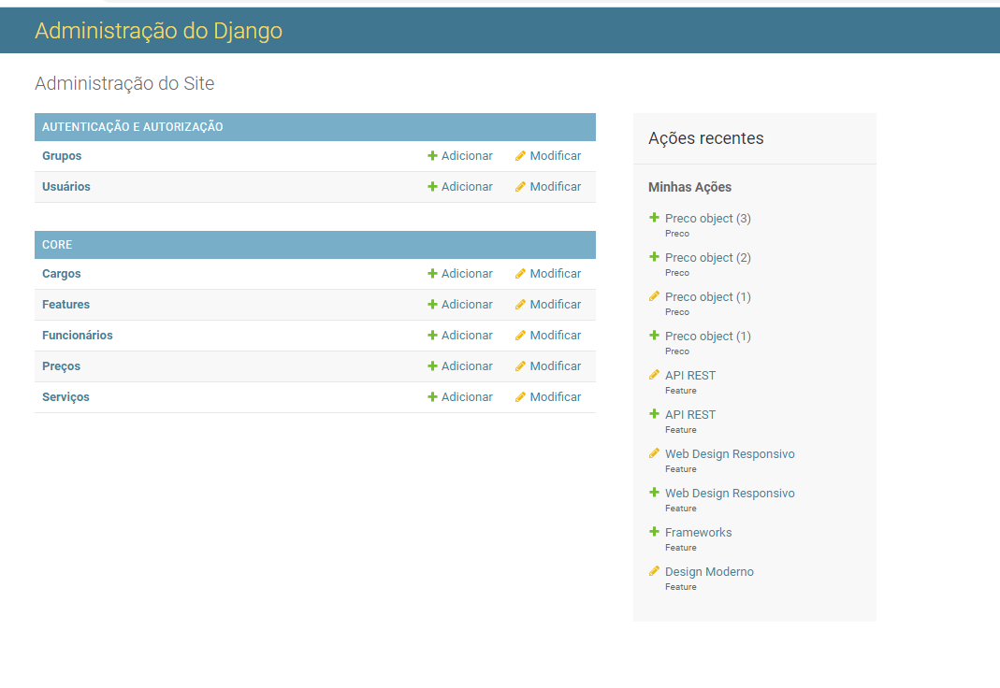
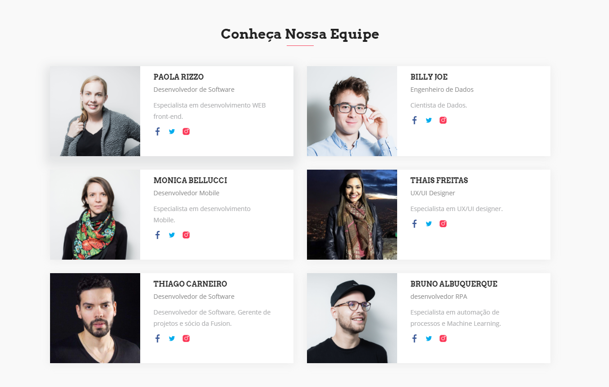
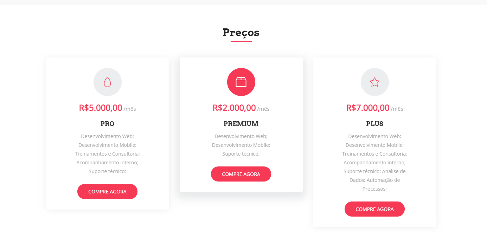
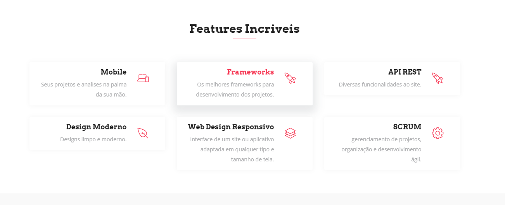
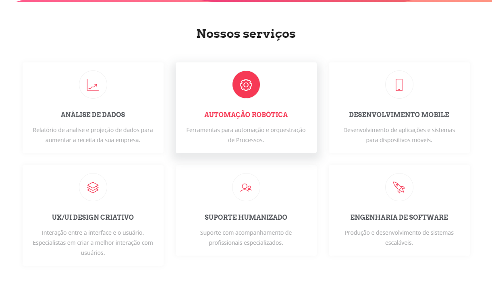
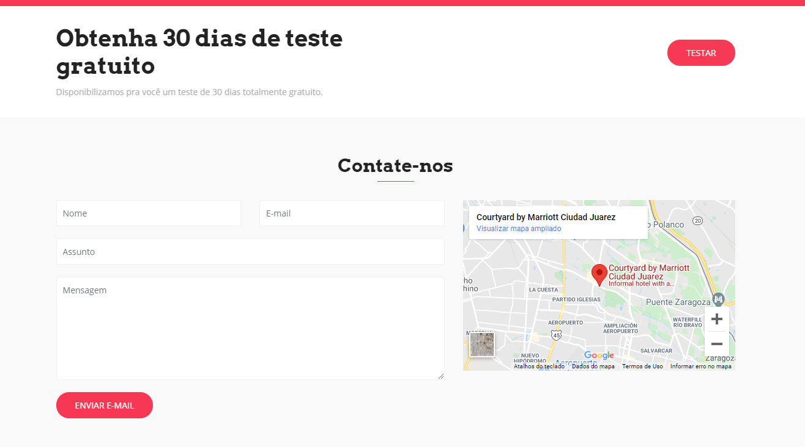

# Projeto Fusion
> Criando um projeto de uma Companhia de Software com Django e Postgres.

Esse projeto cadastra as features, preços, cargos, funcionarios e o serviços da 
companhia cadastrando no banco de dados Postgres integrando com o Admin do Django.
Ele permite que você gerencie todos esses campos através da area administrativa retornando os dados na pagina principal.

### Banco de dados Usando o Models 
[Clique aqui](https://github.com/thiagofreitascarneiro/Projeto_Fusion/blob/main/core/models.py)

#### Cadastro dos Funcionarios

#### Cadastro dos Preços

#### Casdastro das Features

#### Cadastros dos Serviços

### Cadastro do Formulario com o Banco de dados
[Clique aqui](https://github.com/thiagofreitascarneiro/Projeto_Fusion/blob/main/core/forms.py)

#### Formulario

### Deploy na Heroku

## Link do Projeto

Obs: As fotos da equipe só ficam disponiveis por 30 minutos no site devido 
as regras de hospedagem gratuita da Heroku.
### [Clique Aqui](https://fusion-thc.herokuapp.com/)
